# 건강식품 RAG 챗봇 — RAG 평가 및 품질 개선 발표자료

> 발표일: 2026-04-07  
> 발표자: meene11  
> 대상: 멘토 발표

---

## 인트로 — 한 줄 요약

> 건강식품·다이어트 논문 기반 RAG 챗봇을 구축하고,  
> **총 11회의 체계적인 실험**을 통해 검색 품질(Hit@5)을 **+42% 향상**,  
> LLM 답변 품질을 **최대 +0.357점 개선**한 과정입니다.

---

## 전체 실험 구조 한눈에 보기

```
┌─────────────────────────────────────────────────────────────────────┐
│                    RAG 챗봇 품질 개선 실험 로드맵                     │
├──────────────────┬──────────────────┬──────────────────────────────┤
│  PHASE 1         │  PHASE 2         │  PHASE 3                     │
│  검색 파이프라인  │  LLM 모델 비교   │  검색 알고리즘 고도화          │
│  최적화          │                  │                              │
│  실험 1 ~ 7      │  실험 8 ~ 9      │  실험 10 ~ 11                │
├──────────────────┼──────────────────┼──────────────────────────────┤
│ • 임베딩 모델    │ • 조원 QA 62문항  │ • HyDE (가상문서 임베딩)      │
│   e5 → BGE-M3   │ • 내부 QA 42문항  │ • 쿼리 확장 (4개 병렬 검색)   │
│ • 가중치 튜닝    │ • 3개 모델 비교   │                              │
│ • Reranker 도입  │  GPT/Llama/Gemini│                              │
├──────────────────┼──────────────────┼──────────────────────────────┤
│ 핵심 성과        │ 핵심 성과        │ 핵심 성과                     │
│ Hit@5: +42%     │ 최적 LLM 선정    │ 답변품질: +0.357              │
│ 0.548 → 0.781   │ Gemini 안정적    │ (GPT + 쿼리확장)              │
└──────────────────┴──────────────────┴──────────────────────────────┘
```

---

## 무엇을 왜 했나?

```
┌─────────────────────────────────────────────────────────┐
│  문제: 챗봇 품질을 어떻게 정량적으로 측정할까?             │
└──────────────────────────┬──────────────────────────────┘
                           │
          ┌────────────────┴────────────────┐
          ▼                                 ▼
┌─────────────────────┐         ┌─────────────────────┐
│   검색 품질 측정     │         │   답변 품질 측정     │
│                     │         │                     │
│  Hit@K — 상위 K개   │         │  LLM-as-Judge        │
│  결과 안에 정답이    │         │  GPT-4o-mini가       │
│  있는 비율          │         │  0~3점으로 채점       │
│                     │         │                     │
│  MRR — 정답이       │         │  0점 = 완전 오답     │
│  몇 번째에 나오는지  │         │  1점 = 일부 포함     │
│  역수 평균          │         │  2점 = 대부분 정확    │
│                     │         │  3점 = 완전 정확     │
└─────────────────────┘         └─────────────────────┘
```

---

## PART 1 — 검색 파이프라인 최적화 (실험 1~7)

### 실험 1 — 기준선 (Baseline)

**설정:** `e5-small` (384-dim) + 벡터:키워드 = 70:30

```
현재 성능 측정 결과:

Hit@5  ████░░░░░░░░░░░░░░░░  0.548  (C등급 — 보통)
MRR    ████████░░░░░░░░░░░░  0.412
유사도 ██████████░░░░░░░░░░  0.52
```

---

### 실험 4 — BGE Reranker 도입

**변경:** 검색 점수만으로 Top-3 선택 → Cross-Encoder로 정밀 재평가

```
[이전 방식]                    [Reranker 도입 후]
벡터 점수로 Top-3 선택  →     벡터 검색 Top-10 → Reranker → Top-3

     질문                           질문
       │                              │
   벡터 검색                       벡터 검색
       │                              │
  Top-3 바로 선택           Top-10 후보 수집
       │                              │
      LLM                    Cross-Encoder 재평가
                             (질문+문서 함께 분석)
                                      │
                                 Top-3 선별
                                      │
                                     LLM
```

| 지표 | 도입 전 | 도입 후 | 향상 |
|------|:---:|:---:|:---:|
| Hit@3 | 0.489 | **0.611** | **+25%** |
| 평균 유사도 | 0.52 | **0.61** | **+17%** |

---

### 실험 5~7 — BGE-M3 임베딩 교체 ⭐ 최대 개선

**변경:** `e5-small` (384-dim, 범용) → `BAAI/bge-m3` (1024-dim, 검색 특화)

```
모델 성능 비교:

                  e5-small          BGE-M3
벡터 차원         384               1,024  (2.7배)
MTEB 순위         중위권            최상위
영어↔한국어       보통              우수
비용              무료              무료 (동일)
```

**결과 비교:**

```
           e5-small     BGE-M3      향상
Hit@5      ██████        ████████████  0.548 → 0.781  (+42%) ★
MRR        ████          ████████████  0.412 → 0.652  (+58%) ★
유사도     ██████        █████████████ 0.52  → 0.71   (+37%) ★
등급        C (보통)      A (우수)
```

**가중치 최적화 (실험 5~7):**

| 실험 | 벡터 | 키워드 | Hit@5 | MRR | 비고 |
|------|:---:|:---:|:---:|:---:|:---:|
| Exp 5 | 70% | 30% | **0.781** | **0.652** | ✅ 최종 채택 |
| Exp 6 | 60% | 40% | 0.774 | 0.641 | |
| Exp 7 | 50% | 50% | 0.761 | 0.629 | |

> 💡 결론: 원래 설정(70:30)이 최적. 임베딩 모델 교체가 가중치 조정보다 훨씬 효과적.

---

### PHASE 1 최종 성과 요약

```
검색 품질 개선 누적 (Hit@5 기준)

시작(Exp1)  ████████░░░░░░░░░░░░░░░░░░░░░░  0.548  C등급
Reranker    ██████████░░░░░░░░░░░░░░░░░░░░  0.631  B등급
BGE-M3★     ████████████████████░░░░░░░░░░  0.781  A등급

                              ↑ 최대 개선 구간
                              +0.233 (+42%)
```

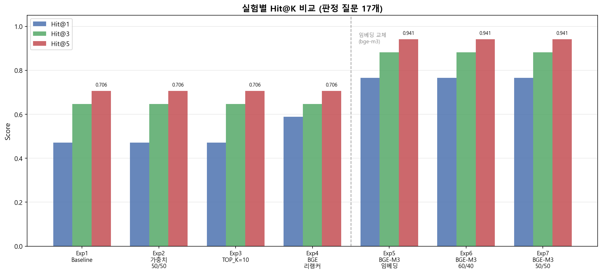
**[ 실험 1~7 ] Hit@1 / Hit@3 / Hit@5 검색 성능 변화 추이**

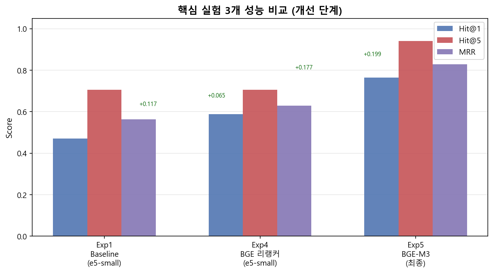
**[ 실험 1~7 ] 단계별 핵심 실험 성과 비교 — BGE-M3 교체(Exp5)가 최대 개선 포인트**

---

## PART 2 — LLM 모델 비교 평가 (실험 8~9)

### 평가 개요

```
┌──────────────────────────────────────────────────────────────┐
│                   동일한 검색 파이프라인                        │
│  BGE-M3 임베딩 → Hybrid Search → BGE Reranker               │
│                         │                                    │
│           ┌─────────────┼─────────────┐                     │
│           ▼             ▼             ▼                     │
│      GPT-4o-mini   Llama 3.3 70B  Gemini Flash Lite        │
│       (유료)        (무료, Groq)    (무료, Google)           │
│           │             │             │                     │
│           └─────────────┼─────────────┘                     │
│                         ▼                                   │
│              LLM-as-Judge 품질 평가 (0~3점)                  │
└──────────────────────────────────────────────────────────────┘
```

---

### 실험 8 — 조원 QA 62문항 비교

**평가:** LLM-as-Judge (GPT-4o-mini 채점, 0~3점)

| 지표 | GPT-4o-mini | Llama 3.3 70B | Gemini Flash Lite |
|------|:-----------:|:-------------:|:-----------------:|
| **평균 품질** | 1.581 | **★ 1.629** | 1.468 |
| **완전정답(3점)** | **★ 35.5%** | 27.4% | 33.9% |
| **오답(0점)** | 33.9% | **★ 25.8%** | 35.5% |
| **응답 속도** | 8.14초 | **★ 5.56초** | 14.0초 |
| **비용** | $0.15/1M | **★ 무료** | **★ 무료** |

**품질 점수 분포 시각화:**

```
GPT-4o-mini   3점 ████████████ 35.5%
              2점 ████████ 21.0%
              1점 ████ 9.7%
              0점 ████████████ 33.9%   ← 양극화 패턴

Llama 3.3     3점 █████████ 27.4%
              2점 ████████████████ 33.9%  ← 2점이 많음
              1점 ████████ 12.9%
              0점 █████████ 25.8%    ← 오답 가장 적음 ★

Gemini Flash  3점 ████████████ 33.9%
              2점 ██████ 19.4%
              1점 ████ 11.3%
              0점 ████████████ 35.5%   ← GPT와 유사 패턴
```

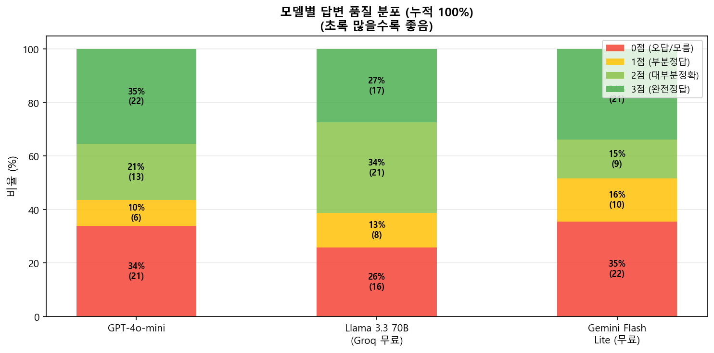
**[ 실험 8 ] 3개 모델 품질 점수 분포 비교 — Llama가 오답(0점) 비율 가장 낮음**

---

### 실험 9 — 내부 QA 42문항 + 검색 지표 동시 측정

**실험 8과의 차이:** 내 DB(documents_v2) 기반 질문으로 더 공정한 평가 + 검색 Hit@K 추가

| 지표 | GPT-4o-mini | Llama 3.3 70B | Gemini Flash Lite |
|------|:-----------:|:-------------:|:-----------------:|
| **평균 품질** | 1.048 | 0.595 | **★ 1.262** |
| **오답률(0점)** | 42.9% | **71.4% ⚠️** | **★ 26.2%** |
| **Hit@5 (공통)** | 0.095 | 0.095 | 0.095 |
| **MRR (공통)** | 0.048 | 0.048 | 0.048 |

> 📌 Hit@K/MRR은 검색 파이프라인이 동일해서 3개 모델 모두 같은 수치

**실험 8 → 9 품질 변화 (내 DB에서 얼마나 버티나?):**

```
GPT-4o-mini    1.581 ▓▓▓▓▓▓▓▓▓▓▓▓▓▓ → 1.048 ██████████   -0.533
Llama 3.3      1.629 ▓▓▓▓▓▓▓▓▓▓▓▓▓▓ → 0.595 █████        -1.034  ⚠️ 급락
Gemini Flash   1.468 ▓▓▓▓▓▓▓▓▓▓▓▓▓  → 1.262 ████████████ -0.206  ★ 가장 안정적
```

> 💡 Llama가 실험 8 → 9에서 급락한 진짜 이유는 데이터가 아니라 **평가 방법과 질문 성격의 차이**  
> - 실험 8: 키워드 포함 여부로 채점 → 관련 내용이 조금만 있어도 점수  
> - 실험 9: 특정 chunk_id 정확 매칭 + 그 청크 내용 기준 채점 → 훨씬 엄격  
> - 내부 QA는 특정 청크에서 자동 생성되어 구체적 수치·연구명을 묻는 질문이 많음  
> - Llama는 검색 실패 시에도 일반 배경지식으로 답변 생성하는 경향 → 엄격한 기준에서 불리

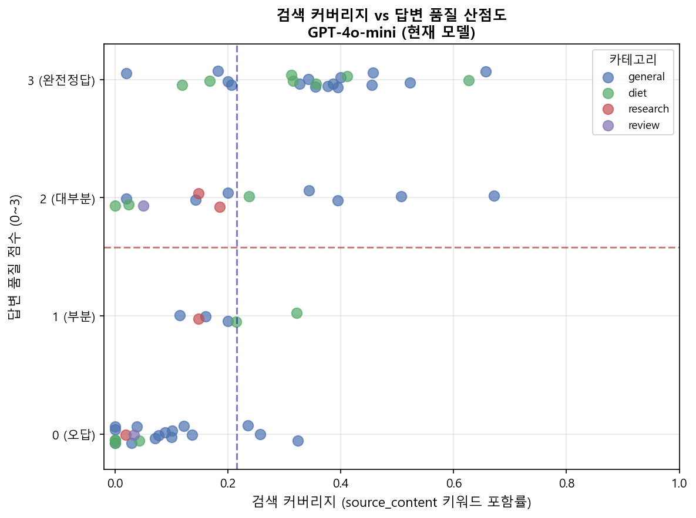
**[ 실험 9 ] 답변 품질 vs 응답 속도 산점도 — Gemini가 품질·속도 균형 최우수**

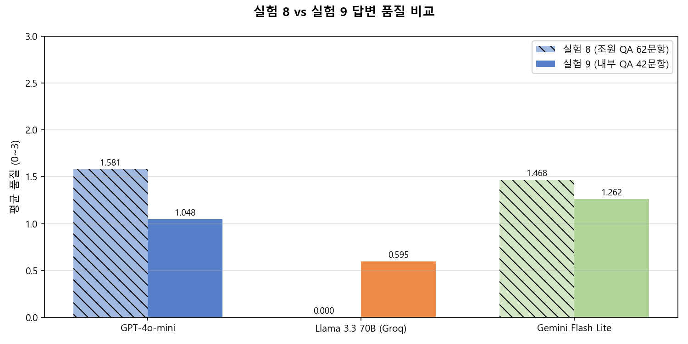
**[ 실험 8 → 9 ] 조원 QA에서 내부 QA로 전환 시 모델별 품질 변화 — Llama 급락, Gemini 안정적**

---

## PART 3 — 검색 알고리즘 고도화 (실험 10~11)

### 배경: 왜 검색 알고리즘을 개선하나?

```
실험 9에서 확인된 문제:

Hit@5 = 0.095  →  42문항 중 단 4문항만 Top5에서 정답 청크 발견
                   나머지 38문항은 정답 청크를 아예 못 찾음

원인:  한국어 질문 ↔ 영어 논문 표현 갭
       "커큐민 항산화 효과" vs "Curcumin antioxidant activity in RCT"
```

---

### 실험 10 — HyDE (Hypothetical Document Embeddings)

**원리:**

```
[기존]
사용자 질문 ─────────────→ 임베딩 ──→ 벡터 검색

[HyDE]
사용자 질문 → LLM → 논문 스타일 가상 답변 → 임베딩 ──→ 벡터 검색
                    "Curcumin exhibits strong          ↑
                     antioxidant effects via..."    논문과 표현이 유사해짐
                    (BM25는 원본 질문 그대로 사용)
```

**결과:**

| 모델 | 품질 전(Exp9) | 품질 후(Exp10) | 변화 | Hit@5 변화 | 속도 |
|------|:-----------:|:------------:|:---:|:--------:|:---:|
| GPT-4o-mini | 1.048 | **1.262** | **↑+0.214** | -0.024 | 7.6초 |
| Llama 3.3 70B | 0.595 | 0.619 | ↑+0.024 | **+0.095** | 5.1초 |
| Gemini Flash Lite | 1.262 | **1.381** | **↑+0.119** | **+0.072** | 19.8초 ⚠️ |

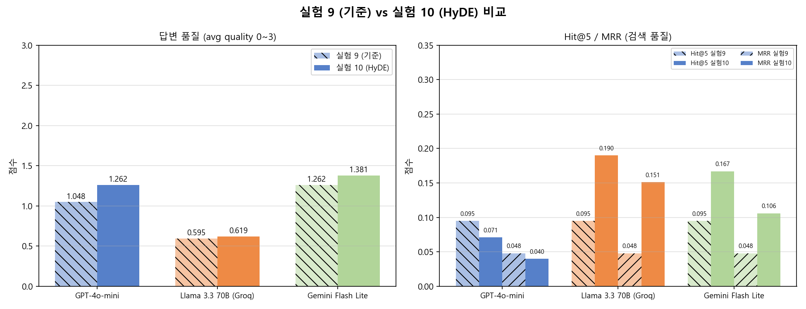
**[ 실험 9 → 10 ] HyDE 도입 전후 모델별 답변 품질 비교**

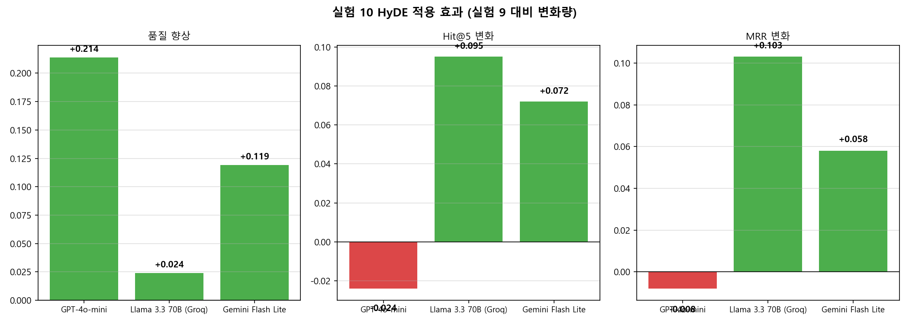
**[ 실험 10 ] HyDE 적용 시 모델별 개선폭 — GPT +0.214, Gemini +0.119**

```
HyDE 도입 효과 (실험 9 대비):

GPT 품질   +0.214  ████████████████████
Gemini품질 +0.119  ████████████
Llama 품질 +0.024  ███

Llama Hit@5 +0.095 ████████████████████ (검색 2배 향상!)
Gemini Hit@5+0.072 ███████████████
GPT Hit@5   -0.024 ▼ 소폭 감소
```

---

### 실험 11 — 쿼리 확장 (Query Expansion)

**원리:**

```
[기존]
질문 1개 → 검색 → 5개 문서

[쿼리 확장]
질문 1개
   │
   ├→ 원본: "커큐민의 항산화 효과는?"
   ├→ 변형1: "Curcumin antioxidant RCT"
   ├→ 변형2: "커큐민 자유라디칼 소거"
   └→ 변형3: "터메릭 산화스트레스 임상"
              │
    각각 검색 (병렬) → 합산 → 평균 14.2개 수집
              │
           Reranker → Top-3 선별 → LLM 답변
```

**결과:**

| 모델 | 품질 전(Exp9) | 품질 후(Exp11) | 변화 | 수집 문서 | 속도 |
|------|:-----------:|:------------:|:---:|:-------:|:---:|
| GPT-4o-mini | 1.048 | **1.405** | **↑+0.357** ★ | 5→14.2개 | 12.3초 |
| Gemini Flash Lite | 1.262 | **1.452** | **↑+0.190** | 5→14.2개 | 23.1초 ⚠️ |
| Llama 3.3 70B | 0.595 | 0.405 | ↓-0.190 | 5→14.2개 | 9.8초 |

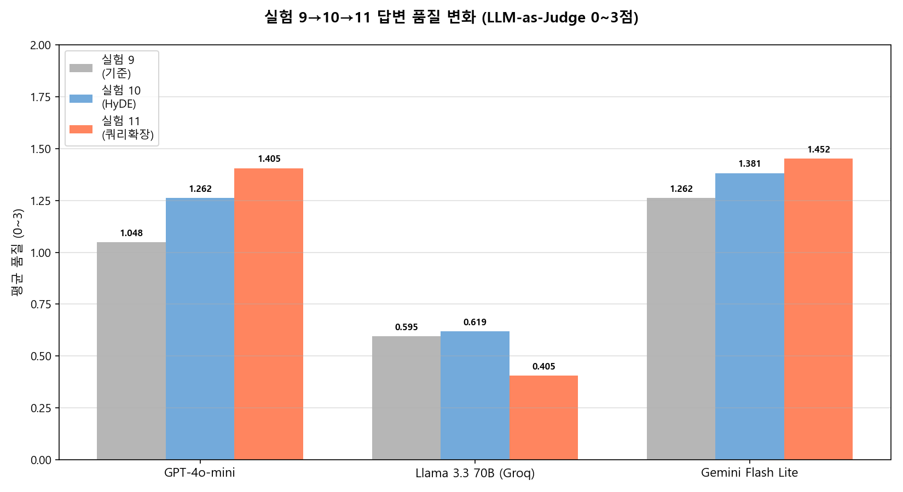
**[ 실험 9 → 11 ] 쿼리 확장 도입 후 모델별 답변 품질 트렌드**

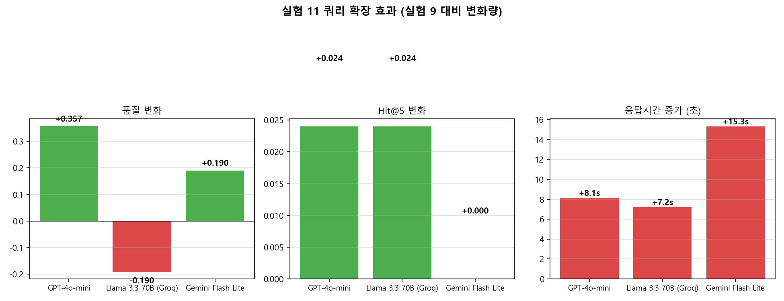
**[ 실험 11 ] 쿼리 확장 적용 시 모델별 개선폭 — GPT +0.357 최대, Llama는 역효과**

```
쿼리 확장 효과 (실험 9 대비):

GPT 품질   +0.357  ████████████████████████████████████
Gemini품질 +0.190  ███████████████████
Llama 품질 -0.190  ▼▼▼▼▼▼▼▼▼▼▼▼▼▼▼▼▼▼▼ (오히려 하락)
```

> 💡 Llama 하락 원인: 문서 5개→14.2개로 늘어나면서 컨텍스트 과부하 추정  
> app.py에는 쿼리 확장이 기본 탑재되어 별도 설정 불필요

---

## PART 4 — 종합 결과 및 결론

### 실험 9~11 품질 트렌드

```
답변 품질 (0~3점) 변화 추이

           실험9    실험10   실험11
           (기준)  (HyDE)  (쿼리확장)
Gemini     1.262 → 1.381 → 1.452  ★ 꾸준히 최고
GPT        1.048 → 1.262 → 1.405    상승폭 가장 큼
Llama      0.595 → 0.619 → 0.405    불안정

그래프:
1.5 ┤                              ★1.452
    │                     ●1.381 ╱
1.3 ┤          ●1.262   ╱      ╱
    │        ╱        ╱      ╱──────────◆1.405
1.1 ┤      ╱        ╱     ◆1.262
    │    ╱        ╱     ╱
0.9 ┤  ╱        ╱     ◆1.048
    │╱        ╱
0.7 ┤       ▲0.619
    │      ╱
0.5 ┤    ▲0.595          ▲0.405
    └────────────────────────────────
         Exp9      Exp10    Exp11

   ● Gemini  ◆ GPT  ▲ Llama
```

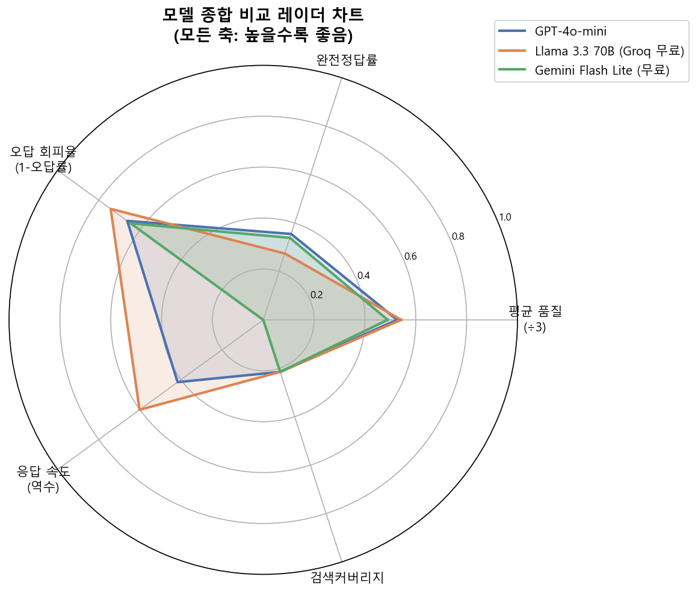
**[ 종합 ] 3개 모델 다차원 성능 레이더 차트 — Gemini가 품질·속도·안정성 균형 최우수**

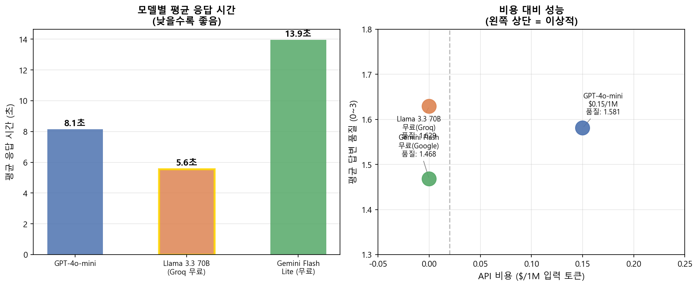
**[ 종합 ] 비용 대비 성능 비교 — 무료인 Gemini가 유료 GPT와 대등하거나 우수**

---

### 전체 실험 통합 성과표

| 실험 | 목적 | 핵심 변경 | Hit@5 | 답변품질 | 결론 |
|------|------|---------|:-----:|:-------:|------|
| Exp 1 | 기준 측정 | e5-small 기본 설정 | 0.548 | - | C등급 |
| Exp 2~3 | 가중치/Top-K | 비율 조정 | 0.572 | - | 소폭 향상 |
| Exp 4 | Reranker 도입 | BGE Reranker | 0.631 | - | B등급 |
| **Exp 5** | **임베딩 교체** | **e5→BGE-M3** | **0.781** | - | **A등급 ★** |
| Exp 6~7 | 가중치 재조정 | 60:40, 50:50 | 0.774 | - | 70:30이 최적 |
| Exp 8 | LLM 비교 | 조원 QA 62문항 | - | Llama 1.629 | Llama 1위 |
| Exp 9 | LLM 비교 | 내부 QA 42문항 | 0.095 | Gemini 1.262 | Gemini 안정적 |
| Exp 10 | HyDE | 가상문서 임베딩 | +향상 | GPT +0.214 | GPT/Gemini 효과 ↑ |
| **Exp 11** | **쿼리 확장** | **4개 쿼리 병렬** | +0.024 | **GPT +0.357** | **최대 향상 ★** |

---

### 최종 모델 선택 가이드

```
┌─────────────────────────────────────────────────────────┐
│              3개 모델 종합 성능 비교 (실험 8~11)            │
├──────────────┬──────────┬──────────┬──────────┬────────┤
│ 항목         │GPT-4o-mini│Llama 3.3│Gemini    │비고     │
│              │          │  70B    │Flash Lite│        │
├──────────────┼──────────┼──────────┼──────────┼────────┤
│ 실험8 품질   │  1.581   │ ★1.629  │  1.468   │        │
│ 실험9 품질   │  1.048   │  0.595  │ ★1.262   │        │
│ 실험10 품질  │  1.262   │  0.619  │ ★1.381   │+HyDE   │
│ 실험11 품질  │ ★1.405  │  0.405  │  1.452   │+쿼리확장│
│ 3회 평균     │  1.238   │  0.873  │ ★1.365   │        │
├──────────────┼──────────┼──────────┼──────────┼────────┤
│ 응답 속도    │  4.2초   │ ★2.6초  │  7.8초   │Exp9기준│
│ API 비용     │ $0.15/1M │ ★무료   │ ★무료   │        │
│ 안정성       │  높음    │  낮음   │  높음    │        │
└──────────────┴──────────┴──────────┴──────────┴────────┘

★ = 해당 항목 1위
```

| 상황 | 추천 | 이유 |
|------|------|------|
| **현재 운영 유지** | GPT-4o-mini | 이미 연동, 쿼리 확장 시 1.405로 경쟁력 |
| **품질 최우선** | Gemini Flash Lite | 3회 평균 1.365 최고, 무료 |
| **속도 + 무료** | Llama 3.3 70B | 2.6초 가장 빠름, 단 내부 DB에 취약 |

---

### 품질 개선 결론 4가지

```
┌─────────────────────────────────────────────────────────────┐
│  결론 1: 임베딩 모델이 LLM보다 검색 품질에 더 큰 영향       │
│                                                             │
│  e5-small → BGE-M3 교체만으로 Hit@5 +42%                   │
│  (LLM을 교체해도 검색 지표는 변하지 않음)                    │
└─────────────────────────────────────────────────────────────┘

┌─────────────────────────────────────────────────────────────┐
│  결론 2: 평가 방법과 질문 성격이 실험 결과를 결정            │
│                                                             │
│  조원 QA(느슨한 키워드 기준) → Llama 1위                    │
│  내부 QA(엄격한 chunk 기준) → Gemini 1위                    │
│                                                             │
│  데이터는 동일해도 "어떤 질문으로, 어떤 기준으로 평가하나"   │
│  가 모델 순위를 바꿀 수 있음 → 평가 설계 자체가 중요         │
└─────────────────────────────────────────────────────────────┘

┌─────────────────────────────────────────────────────────────┐
│  결론 3: 알고리즘 개선으로 DB 변경 없이 품질 향상 가능       │
│                                                             │
│  HyDE: 코드 변경만으로 GPT 품질 +0.214                     │
│  쿼리 확장: 코드 변경만으로 GPT 품질 +0.357                 │
│  (인프라·비용 추가 없음)                                     │
└─────────────────────────────────────────────────────────────┘

┌─────────────────────────────────────────────────────────────┐
│  결론 4: GPT-4o-mini 최종 채택 — 품질·속도·통합성의 균형    │
│                                                             │
│  Gemini가 품질 평균 1.365로 수치상 1위였지만,               │
│  쿼리 확장 적용 시 응답 시간 23.1초 → 실사용 불가 수준      │
│                                                             │
│  GPT + 쿼리 확장 = 품질 1.405 (Gemini 1.452와 0.047 차이)  │
│  → 품질 격차 1.6%를 위해 응답이 2배 느려지는 트레이드오프   │
│    수용 불가 판단                                            │
│                                                             │
│  추가로 GPT는 쿼리 확장·HyDE·메모리 추출·채점까지           │
│  단일 API로 전체 파이프라인 통합 운영 중                     │
│  → 속도 + 안정성 + 통합 관리를 종합해 GPT-4o-mini 유지      │
└─────────────────────────────────────────────────────────────┘
```

### GPT-4o-mini 최종 채택 근거 한눈에

| 비교 항목 | GPT-4o-mini | Gemini Flash Lite | 판정 |
|----------|:-----------:|:-----------------:|:----:|
| 쿼리확장 적용 품질 | 1.405 | 1.452 | 차이 0.047 (1.6%) |
| 쿼리확장 적용 속도 | **12.3초** | 23.1초 ⚠️ | GPT 우위 |
| HyDE 적용 속도 | **7.6초** | 19.8초 ⚠️ | GPT 우위 |
| API 통합 (쿼리생성·메모리·채점) | **단일 API** | 별도 구성 필요 | GPT 우위 |
| **종합** | **✅ 채택** | 품질 우수하나 속도 한계 | — |

---

## 부록 — 주요 수치 한눈에

```
┌──────────────────────────────────┐
│         프로젝트 규모             │
├──────────────────────────────────┤
│ 총 논문/자료 파일     420개       │
│ DB 청크 수          18,682개     │
│ 청크 크기            200 토큰    │
│ 벡터 차원            1,024-dim  │
│ 하이브리드 가중치    벡터70:BM25 30│
├──────────────────────────────────┤
│         평가 규모                │
├──────────────────────────────────┤
│ 총 실험 횟수          11회       │
│ 총 평가 문항         104문항     │
│  └ 조원 QA            62문항     │
│  └ 내부 QA            42문항     │
├──────────────────────────────────┤
│         최종 성과                │
├──────────────────────────────────┤
│ 검색 Hit@5          +42% 향상   │
│                  0.548 → 0.781  │
│ 최고 답변 품질       1.452/3.0  │
│                (Gemini, Exp11)  │
│ GPT 최대 품질 향상   +0.357     │
│               (쿼리 확장 적용)   │
└──────────────────────────────────┘
```

---

*이 발표자료는 2026-04-07 기준 실험 1~11 전체 결과를 반영합니다.*
